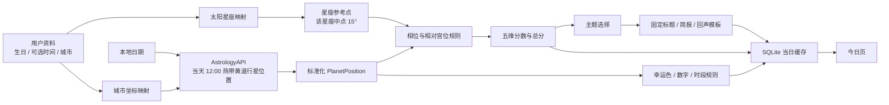

# Stellune 数据生成逻辑与改造方案

> 文档状态：基于 2026-07-23 当前本地代码与实际运行日志整理。关系共鸣和情绪说明书已按第 18 节方案实现。  
> 目的：如实说明每项数据从哪里来、如何计算、哪些仍是固定内容，以及下一版应如何改造。

## 1. 结论

当前实现不是“所有内容都由真实天象生成”，而是四类数据混合：

| 类型 | 典型数据 | 当前真实性 |
| --- | --- | --- |
| 用户资料 | 生日、太阳星座、心情 | 来自用户输入 |
| 真实天象 | 当天行星黄经、星座、速度、逆行状态 | 来自 AstrologyAPI |
| 娱乐规则 | 五维分数、总分、幸运色、数字、时段 | 根据真实天象套用本地规则 |
| 固定模板 | 标题、副标题、三条简报、宇宙回声、抽签文案 | 从少量固定字符串中选择 |

需要特别说明：

1. 五维分数会随日期和太阳星座变化，但使用的是简化规则，不是完整本命盘或专业占星推运。
2. 当前所有同太阳星座、同城市、同一天的用户，分数基本相同。
3. 出生时间目前没有进入星相请求，也没有参与分数计算。
4. 出生城市只支持北京、深圳、广州、杭州、成都；其他输入全部按上海处理。
5. 大模型目前没有被调用，`narrativeProvider` 明确为 `template`。
6. 探索页的关系共鸣和情绪建议已改为 Rust 本地规则动态生成；仍属于娱乐解读，不是专业合盘或心理判断。
7. 抽签结果从 7 组固定签文中确定性选一组，不读取星相，也不调用大模型。

因此，用户感觉“内容像固定的”是准确的。真实变化主要集中在行星位置、规则命中、五维分数和幸运提示，文案变化范围很小。

## 2. 当前完整数据流



### 2.1 稳定性与缓存

当日简报的缓存键包含：

- 本地日期；
- 资料计算版本；
- 生日；
- 出生时间；
- 出生城市；
- 个性化模式；
- 城市映射后的经纬度及时区；
- 规则版本；
- 星相 Provider 版本；
- 文案模板版本。

同一天、同一份资料、同一套规则再次打开应用时，直接读取 SQLite 缓存，不会重新生成，因此页面内容保持稳定。

修改生日、出生时间或城市会增加 `calculationVersion`，重新生成当天简报；只修改昵称不会重新计算。

## 3. 用户资料如何参与计算

### 3.1 太阳星座

生日使用传统日期区间映射为 12 星座，例如：

- 3 月 21 日—4 月 19 日：白羊座；
- 9 月 23 日—10 月 23 日：天秤座；
- 其他星座依此类推。

当前只有生日中的月和日用于判断太阳星座。出生年份以及太阳在出生当天的精确度数没有参与后续计算。

### 3.2 个性化模式

| 条件 | 模式 | 当前实际作用 |
| --- | --- | --- |
| 只有生日，或缺时间/城市之一 | `sunSignLite` | 使用太阳星座和默认/映射城市 |
| 同时有出生时间和城市 | `natal` | 只改变模式标记和缓存键 |

当前 `natal` 只是数据状态，还没有真正生成本命盘。出生时间没有传给 AstrologyAPI，也没有用于宫位、上升星座或本命行星计算。

### 3.3 城市坐标

当前为固定字符串匹配：

| 城市关键词 | 纬度 | 经度 | 时区 |
| --- | ---: | ---: | ---: |
| 北京 | 39.9042 | 116.4074 | +8 |
| 深圳 | 22.5431 | 114.0579 | +8 |
| 广州 | 23.1291 | 113.2644 | +8 |
| 杭州 | 30.2741 | 120.1551 | +8 |
| 成都 | 30.5728 | 104.0668 | +8 |
| 其他、空值 | 31.2304 | 121.4737 | +8 |

缺陷：输入南京、武汉、国外城市等都会按上海处理。

## 4. 真实天象数据如何获取

接口：

```text
POST https://json.astrologyapi.com/v1/planets/tropical
```

当前请求结构：

```json
{
  "day": "本地当天的日",
  "month": "本地当天的月",
  "year": "本地当天的年",
  "hour": 12,
  "min": 0,
  "lat": "城市映射纬度",
  "lon": "城市映射经度",
  "tzone": 8,
  "house_type": "placidus"
}
```

注意：

- 请求的是“当天中午 12:00 的天象”，不是用户出生时刻。
- API Key 仅放在请求 Header，不写入日志。
- 日志中的 `lat/lon/tzone` 会脱敏。
- 原始请求、原始响应和标准化结果会保存到本地 SQLite，便于复盘。

响应被统一转换成：

```json
{
  "planet": "Mars",
  "longitude": 77.05,
  "degreeInSign": 17.05,
  "sign": "Gemini",
  "speed": 0.68,
  "retrograde": false
}
```

规则层主要使用：

- `planet`：行星名称；
- `longitude`：黄经，用于相位判断；
- `sign`：所在星座，用于简化“相对宫位”；
- `degreeInSign`：用于幸运数字；
- `retrograde`：目前只对水星规则产生额外影响。

API 返回的 Ascendant 等数据目前没有进入有效规则。

## 5. 五维分数生成逻辑

### 5.1 五个维度

| 字段 | UI | 含义 |
| --- | --- | --- |
| `love` | 情感 | 亲密关系与情感表达 |
| `work` | 工作 | 行动力、沟通与推进 |
| `wealth` | 财运 | 资源、机会与消费节奏 |
| `social` | 社交 | 人际互动与群体连接 |
| `inner` | 内心 | 情绪稳定与自我觉察 |

五个维度初始值全部为 `75`。

### 5.2 星座参考点

程序没有计算用户本命太阳的真实度数，而是把太阳星座的中点作为参考：

```text
referenceDegree = 星座序号 × 30° + 15°
```

例如天秤座序号为 6：

```text
6 × 30° + 15° = 195°
```

因此所有天秤座用户都使用 `195°` 作为同一个参考点。

### 5.3 主要相位

当天每颗行星黄经与参考点比较，只识别：

| 相位 | 目标角度 |
| --- | ---: |
| 合相 `conjunction` | 0° |
| 六分 `sextile` | 60° |
| 四分 `square` | 90° |
| 三分 `trine` | 120° |
| 对冲 `opposition` | 180° |

容许度统一为 `±6°`。

当前没有根据容许度连续衰减：相差 `0.2°` 和相差 `5.9°` 只要命中同一规则，分数影响完全相同。

已实现的相位规则有限：

| 行星与相位 | 分数影响 |
| --- | --- |
| 火星三分/六分 | 工作 +8、社交 +7、情感 +2 |
| 火星四分/对冲 | 工作 -4、内心 -3 |
| 水星四分/对冲 | 工作 -5、财运 -2、社交 -3、内心 -3 |
| 水星三分/六分 | 工作 +5、社交 +4 |
| 土星四分/对冲 | 情感 -8、社交 -6、内心 -5 |
| 木星三分/六分 | 工作 +4、财运 +5、社交 +5 |
| 金星三分/六分 | 情感 +5、内心 +3 |
| 月亮三分/六分 | 内心 +4 |
| 月亮四分/对冲 | 内心 -3 |
| 太阳三分/六分 | 工作 +3、社交 +4 |
| 其他组合 | 0 |

水星逆行时，在已有水星影响上再追加：

```text
工作 -1，内心 -1
```

### 5.4 “相对宫位”规则

当前并没有读取真实本命宫头，而是按“行星所在星座序号 - 用户太阳星座序号”换算 1—12 宫。

只有下列组合有效：

| 组合 | 分数影响 |
| --- | --- |
| 太阳在简化第 11 宫 | 工作 +3、社交 +4 |
| 木星在简化第 11 宫 | 工作 +3、财运 +5、社交 +6 |
| 金星在简化第 12 宫 | 情感 +3、财运 -2、内心 +6 |
| 冥王星在简化第 5 宫 | 情感 +4 |
| 天王星在简化第 9 宫 | 工作 +2 |
| 月亮在简化第 2 宫 | 内心 +2 |
| 海王星在简化第 7 宫 | 内心 -2 |
| 其他组合 | 0 |

这只是娱乐规则中的“太阳星座相对宫位”，不能称为用户真实本命宫位。

### 5.5 限幅和总分

累加影响后，每个维度限制在 `55—92`：

```text
dimension = clamp(dimension, 55, 92)
```

总分权重：

```text
总分 =
  情感 × 20%
  + 工作 × 25%
  + 财运 × 15%
  + 社交 × 20%
  + 内心 × 20%
```

最后四舍五入为整数。

雷达图上的五颗星不是背景装饰，顶点位置直接由这五个分数决定。

## 6. 截图中 2026-07-23 天秤座的实际算式

运行日志记录的有效规则如下：

| 规则 | 情感 | 工作 | 财运 | 社交 | 内心 |
| --- | ---: | ---: | ---: | ---: | ---: |
| 初始值 | 75 | 75 | 75 | 75 | 75 |
| 太阳·简化第 11 宫 | 0 | +3 | 0 | +4 | 0 |
| 月亮·简化第 2 宫 | 0 | 0 | 0 | 0 | +2 |
| 火星·三分 | +2 | +8 | 0 | +7 | 0 |
| 水星·四分且逆行 | 0 | -6 | -2 | -3 | -4 |
| 木星·简化第 11 宫 | 0 | +3 | +5 | +6 | 0 |
| 金星·简化第 12 宫 | +3 | 0 | -2 | 0 | +6 |
| 土星·对冲 | -8 | 0 | 0 | -6 | -5 |
| 天王星·简化第 9 宫 | 0 | +2 | 0 | 0 | 0 |
| 海王星·简化第 7 宫 | 0 | 0 | 0 | 0 | -2 |
| 冥王星·简化第 5 宫 | +4 | 0 | 0 | 0 | 0 |
| 最终值 | **76** | **85** | **76** | **83** | **72** |

总分：

```text
76 × 0.20
+ 85 × 0.25
+ 76 × 0.15
+ 83 × 0.20
+ 72 × 0.20
= 78.85
≈ 79
```

这与截图中的：

```text
情感 76 / 工作 85 / 财运 76 / 社交 83 / 内心 72 / 总分 79
```

一致。

## 7. 标题、简报和宇宙回声

### 7.1 今日主题

主题选择顺序：

1. 只要命中“土星对冲”，主题直接为 `校准`；
2. 否则只要命中“水星四分”，主题为 `复核`；
3. 否则取五维最高分：
   - 情感最高：`柔软`
   - 工作最高：`行动`
   - 财运最高：`整理`
   - 社交最高：`靠近`
   - 内心最高：`沉淀`

截图当天命中了土星对冲，因此无论工作分是否最高，主题优先得到 `校准`。

### 7.2 主标题与副标题

当前是固定模板映射，不是大模型生成：

| 主题 | 标题 |
| --- | --- |
| 校准 | 把光留给真正值得回应的地方 |
| 复核 | 慢一点确认，也是一种清醒 |
| 行动 | 你的方向，正在变得清晰 |
| 靠近 | 真诚正在缩短彼此的距离 |
| 其他 | 你的星图，正在缓慢变亮 |

截图中的副标题“行动可以向前，答案不必急着说完。”同样是 `校准` 模板的固定字符串。

### 7.3 今日宇宙简报

三条简报各只有两个版本：

- 关系：`love >= 80` 或 `< 80`；
- 工作：`work >= 80` 或 `< 80`；
- 自我：`inner >= 80` 或 `< 80`。

因此当前最多只有 `2 × 2 × 2 = 8` 种简报组合，而且每条文字固定。

截图中：

- 情感 `76 < 80`，选择“清楚表达边界……”；
- 工作 `85 >= 80`，选择“行动力正在回升……”；
- 内心 `72 < 80`，选择“给独处留一点空间……”。

### 7.4 宇宙回声

宇宙回声也是按主题选择固定字符串，共 5 组：

- 校准；
- 复核；
- 行动；
- 靠近；
- 默认。

截图中的：

> 慢一点回答，不代表你没有答案。有时，那是内心在替你筛选真正重要的声音。

是 `校准` 主题对应的固定文本。

### 7.5 大模型状态

当前代码没有调用 DeepSeek。环境变量虽然预留了模型配置，但生成日志显示：

```json
{
  "narrativeProvider": "template"
}
```

`generation.input` 和 `generation.output` 日志接口已经预留，可供后续模型 Provider 复用。

## 8. 幸运色、幸运数字和幸运时段

这些是确定性娱乐规则，不是 API 直接返回的“幸运数据”。

### 8.1 幸运色

根据当天火星所在星座序号 `% 4`，只会得到四种颜色：

| 结果 | 颜色 |
| ---: | --- |
| 0 | 余晖金 |
| 1 | 晨雾蓝 |
| 2 | 雾紫 |
| 3 或无火星 | 月光银 |

截图当天火星在双子座，双子序号为 2，因此为 `雾紫`。

### 8.2 幸运数字

```text
幸运数字 =
((月亮所在星座内度数向下取整 + 用户星座序号 + 1) % 9) + 1
```

截图当天：

```text
月亮度数 floor(19.47) = 19
天秤座序号 = 6
((19 + 6 + 1) % 9) + 1 = 9
```

所以显示 `幸运数字 9`。

当前 `basis` 文案写了“与本地日期稳定计算”，但公式只有在缺失月亮数据时才直接使用日期；正常情况下日期只是通过当天月亮位置间接影响结果。这段说明需要修正。

### 8.3 幸运时段

旧版根据月亮所在星座序号 `% 4`，只能得到 `18:00—23:00` 之间的四个
夜间窗口。这会从算法上排除全部白天时段，已经移除。

当前轻量规则使用 AstrologyAPI 在当天 12:00 返回的月亮黄经和日运行速度，
近似推算 07:00—23:00 内每个两小时窗口中点的月亮位置：

```text
moonLongitude(t)
= normalize(moonLongitudeAt12
  + moonSpeedPerDay × (t - 12) / 24)
```

随后计算月亮与用户太阳星座参考点的角距。只有角距在候选窗口内接近合相
`0°`、六合 `60°` 或三合 `120°`，且容许度不超过 `3°` 时，才返回该窗口。
如果当天没有接近精确的和谐相位，则返回“全天平稳”，不会为了每天必须有一个
时间而强行选择最早或最晚时段。没有月亮数据时同样不指定单一时段。

这仍是太阳星座级别的娱乐规则，不是完整择时。完整资料模式后续应优先读取
`natal_transits/daily` 的 `exact_time`，计算当前行星与用户真实本命点位的精确
行运。

## 9. 心情与星迹页

### 9.1 今日心情

五个心情选项固定为：

```text
开心 / 平静 / 迷茫 / 疲惫 / 低落
```

心情不是系统推断，而是用户主动选择。保存后按本地日期写入 SQLite。

### 9.2 七日星迹

星迹页使用真实已保存记录计算：

- 七日平均能量：已有每日总分的算术平均；
- 主要情绪：用户记录次数最多的心情；
- 上升维度：最后一天与第一天五维差值中最大的维度；
- 每日主题、总分、回声：读取当日简报快照。

如果只有一天数据，趋势信息的意义有限。Playwright fixture 中的七天数据仅用于自动化测试，不会进入 Release App。

## 10. 探索页数据

### 10.1 每日抽签

签运来自 100 支原创“星轨百签”。结构参考传统编号签的编号、签级、签诗、
解曰和提醒，但不复制观音签、黄大仙签或其他现成宗教签谱。每一支都有独立的
标题、签诗、解释和建议。

签级分布：

| 签级 | 数量 |
|---|---:|
| 上上签 | 6 |
| 上签 | 16 |
| 中上签 | 20 |
| 中签 | 25 |
| 中下签 | 15 |
| 下签 | 16 |
| 下下签 | 2 |

签级通过编号的固定排列分散在 1—100 之间，不按连续编号分组。下签只表达暂停、
核对、休息或求助，不表达灾祸必然发生。

选择索引：

```text
SHA256(本地日期 + guestId + 抽签规则版本) 的前 8 位 % 100
```

特点：

- 首次抽取在同一用户同一天保持稳定；
- 用户主动重抽时加入随机 nonce，并保证不重复当前签；
- 当天数据库记录始终保存最近一次抽取结果；
- 一天只保存一次；
- 不读取真实星相；
- 不调用大模型；
- 签号、签级、签诗、解释和建议来自版本化原创签库；
- 当前签库版本为 `2026.07.2`，调整数量、内容或分布时必须升级版本；
- 签库权威内容位于 `src-tauri/src/domain/fortune_catalog.rs`。

### 10.2 关系共鸣

当前提供 12 星座选项。前端将对方星座传给 `get_compatibility`，Rust
`domain/explore.rs` 根据双方太阳星座的元素、模式、极性和黄道距离计算分数、
等级、标题、说明及四个解释因子。天秤座与双子座为 `85`，天秤座与巨蟹座为
`51`，切换选择会真实改变结果。

该结果明确标记为 `sunSignCompatibility` 和 `sun-sign-entertainment`，
不宣称是需要双方出生时间、地点和完整本命盘的 Synastry。

### 10.3 情绪说明书

当前 UI 展示开心、疲惫、低落三个快捷选项，领域引擎支持全部五种心情。
点击后先调用 `get_emotion_guide` 校验并生成内容，成功后再串行保存当天唯一的
`MoodEntry`。服务读取同一天的今日简报，将用户主动选择的心情、今日主题和
五维分数档位转换为标题、说明、需要和一个行动建议。重新打开页面时优先读取
当天已保存的心情；没有记录时保持未选择状态并邀请用户主动选择。系统不会根据
行为猜测心情。

## 11. 为什么用户会感觉每天都差不多

1. 所有维度都从 75 开始，分数天然集中在中高区间。
2. 有效规则表很小，多数行星和相位组合不会产生任何影响。
3. 相位影响没有按容许度强弱变化。
4. 同一星座所有用户共用星座中点，而不是各自本命盘。
5. 出生时间没有参与计算。
6. 城市映射非常有限。
7. 三条简报只有 8 种组合。
8. 标题和回声各只有约 5 种。
9. 幸运色目前只有 4 种；幸运时段已改为日内相位扫描，但轻量模式仍只使用太阳星座参考点。
10. 关系共鸣和情绪说明书已经动态化，但仍使用有限规则和本地模板，丰富度有限。
11. 同一天会命中本地缓存，这是合理稳定策略，但也会放大固定感。

## 12. 建议的 V2 生成逻辑

### 12.1 分成两个明确模式

#### 轻量太阳星座模式

只有生日时：

1. 根据出生日期计算真实太阳度数，而不是使用星座中点；
2. 获取当天行星位置；
3. 计算当天行星对出生太阳的推运相位；
4. 明确标记为“太阳星座娱乐解读”。

#### 完整本命盘模式

用户提供出生日期、准确时间和城市时：

1. 城市通过地理编码转换为真实经纬度和 IANA 时区；
2. 获取出生时刻的本命行星、上升点、天顶和宫头；
3. 保存本命盘快照，资料不变时无需每日重算；
4. 获取当天或未来 24 小时的推运行星；
5. 计算“推运行星 → 本命行星/宫位”的相位；
6. 由实际命中规则生成五维草稿。

### 12.2 分数公式

建议每条影响使用连续强度，而不是固定加减：

```text
orbStrength = max(0, 1 - 实际容许度 / 最大容许度)

impact =
  行星维度权重
  × 相位正负系数
  × orbStrength
  × 本命点重要度
  × 顺逆行修正
  × 宫位相关度
```

示例：

```text
推运金星三分本命月亮
→ 情感、内心获得正向影响
→ 容许度越小，影响越强

推运水星四分本命水星
→ 工作、沟通、内心获得挑战影响
→ 若推运水星逆行，沟通维度额外修正
```

建议把每个维度的命中依据保存在 `ReadingTrace`，前端可以展示“为什么是这个分数”，避免黑盒。

### 12.3 文案生成

先产生不含用户身份信息的结构化草稿：

```json
{
  "date": "2026-07-23",
  "zodiac": "libra",
  "mode": "natal",
  "scores": {
    "love": 76,
    "work": 85,
    "wealth": 76,
    "social": 83,
    "inner": 72
  },
  "topSupportiveFactors": [],
  "topChallengingFactors": [],
  "theme": "校准"
}
```

再调用大模型，只让模型负责表达：

- 1 个标题；
- 1 个副标题；
- 关系/工作/自我三条短简报；
- 1 条宇宙回声；
- 每条文案标记其依据的规则 ID。

模型输出必须使用 JSON Schema 校验，并限制：

- 不作确定性预言；
- 不生成医疗、金融、法律建议；
- 不使用恐吓或宿命论；
- 不泄露昵称、生日、城市等个人信息；
- 文案失败时回退到本地模板。

同一日同一 `ReadingDraft + promptVersion + modelVersion` 只生成一次并缓存，保证刷新后不变。

### 12.4 幸运数据

幸运数据必须明确定位为“娱乐提示”。

建议：

- 幸运色：由当天最强正向行星、元素和五维最高项映射到至少 12 色调色板；
- 幸运数字：保留稳定算法，但在 UI 说明为娱乐规则；
- 幸运时段：轻量模式已按月亮日内运行扫描接近精确的和谐相位；完整模式应改用个人行运 `exact_time`；
- 所有结果保存 `basis`，可在详情中解释来源。

### 12.5 关系共鸣

最低可用版本：

```text
共鸣分 =
  元素关系 30%
  模式关系 20%
  守护星关系 20%
  今日双方太阳星座推运 30%
```

完整版本应允许对方自愿填写生日，计算两张本命盘的合盘相位。只选星座时必须标记为轻量娱乐匹配，不能伪装成精确合盘。

### 12.6 情绪说明书

输入：

- 用户主动选择的心情；
- 当日主题；
- 内心、社交、工作三个相关分数；
- 最强支持因素和挑战因素。

输出可以先使用 `心情 × 主题` 模板矩阵，后续再交给同一个文案 Provider。这样按钮切换后，标题和建议必须真实变化。

### 12.7 每日抽签

抽签本质上是娱乐随机，不需要伪装成天象结论。建议：

1. 扩大签库，例如 49 或 64 组；
2. 签级仍由 `date + guestId + rulesVersion` 稳定确定；
3. 今日主题只影响解释角度，不暗中修改抽签概率；
4. 大模型可以润色解释，但签级和签意 ID必须先由本地规则确定；
5. 日志记录签意 ID、规则版本和生成 Provider。

## 13. 改造优先级

### P0：修复“看起来是假数据”

1. 关系共鸣根据选择真实变化，移除固定 `88`。
2. 情绪按钮接入状态，建议随心情和今日主题变化。
3. 标题、简报、回声接入结构化大模型生成，并保留模板回退。
4. UI 增加“真实天象 + 娱乐解读”来源说明。

### P1：提高分数可信度

1. 太阳星座模式改用真实出生太阳度数。
2. 完整资料模式真正计算本命盘。
3. 相位影响加入容许度连续权重。
4. 扩充行星、相位、宫位与五维映射表。
5. 城市接入地理编码和真实时区。

### P2：改善丰富度

1. 幸运色扩大调色板；
2. 幸运时段已改为逐时计算；后续接入完整资料的个人行运精确时间；
3. 扩充签库；
4. 星迹页增加规则依据和变化原因。

## 14. 验收标准

下一版完成后，应满足：

1. 同一天、同星座但出生日期不同的用户，至少部分分数或依据不同。
2. 完整出生时间/城市能实际改变本命盘和每日结果，而不只是改变缓存键。
3. 关系下拉切换后，分数、标题、说明同步变化。
4. 情绪按钮切换后，建议同步变化。
5. 每条标题、简报、回声可以追溯到 `ReadingTrace` 中的规则 ID。
6. 日志能串起：星相请求 → 标准化 → 规则影响 → 分数 → 文案输入 → 文案输出。
7. 模型不可用时仍能返回结构正确的本地模板。
8. 同一用户同一天重复打开结果稳定。
9. UI 明确标注娱乐属性，不把规则分数描述为科学预测。

## 15. 当前代码位置

| 逻辑 | 文件/函数 |
| --- | --- |
| 生日映射星座 | `src-tauri/src/domain/rules.rs::zodiac_from_birthday` |
| 星相请求与标准化 | `src-tauri/src/infrastructure/astrology.rs` |
| 资料模式与缓存键 | `src-tauri/src/services/mod.rs` |
| 五维规则和总分 | `src-tauri/src/domain/rules.rs::calculate_reading` |
| 标题、简报、回声模板 | `render_hero` / `render_briefs` / `render_echo` |
| 幸运提示 | `calculate_lucky` |
| 抽签 | `fortune_by_index` / `draw_fortune` |
| 星迹摘要 | `summarize_trail` |
| 关系共鸣与情绪说明书 | `src-tauri/src/domain/explore.rs` / `src/stores/explore.ts` |
| 本地持久化 | `src-tauri/src/infrastructure/database.rs` |
| 生成链路日志 | `src-tauri/src/infrastructure/logger.rs` |

## 16. 业界公开实现调研

本节只记录厂商公开说明或公开 API 文档能够确认的部分。各产品内部的最终评分权重通常不公开，不能把推测写成事实。

### 16.1 CHANI：上升星座内容 + 个人行运

CHANI 公开说明了两层内容：

1. 面向所有用户的 Planetary Horoscopes，会按上升星座解释当前行星落入哪些生活宫位；
2. 更个性化的 Transits，会计算当前行星与用户本命行星/点位的接触。

它使用合相、六分、四分、三分和对冲五类传统相位，并根据：

- 推运行星的重要程度；
- 本命点是否敏感；
- 相位是否足够接近；
- 快行星和慢行星持续时间差异；

筛选展示内容，而不是把所有命中项都塞给用户。

CHANI 对推运使用“按精确度数判断”的相位；相位越接近精确角度，越值得在当前时间展示。出生时间未知时允许用中午 12:00 估算，但明确提醒结果会不够精确。

对 Stellune 的启示：

- 只有生日时，可以明确提供低精度模式；
- 有准确出生时间时，应该以用户真实本命点为目标计算推运；
- 不应继续把整个太阳星座统一替换成该星座中点；
- UI 应优先展示少量最重要、最接近精确时刻的行运。

来源：

- [CHANI：Transits](https://chaninicholas.zendesk.com/hc/en-us/articles/4409909027731-Transits)
- [CHANI：Aspects Used in the CHANI app](https://chaninicholas.zendesk.com/hc/en-us/articles/5275452307475-Aspects-Used-in-the-CHANI-app)
- [CHANI：Rising Sign vs. Sun Sign Content](https://chaninicholas.zendesk.com/hc/en-us/articles/360062139993-Rising-Sign-vs-Sun-Sign-Content)
- [CHANI：Unknown Birth Time](https://chaninicholas.zendesk.com/hc/en-us/articles/4411093003539-Unknown-Birth-Time)

### 16.2 TimePassages：完整本命盘 + 个人推运 + 人工解释库

TimePassages 公开说明其 Daily Horoscope 来自：

```text
当前天空中的行星
→ 与用户本命盘行星形成重要相位
→ 将个人推运分类并解释
```

其本命盘输入使用准确出生日期、时间和地点。相位系统还会区分：

- 本命、推运、次限、太阳回归和合盘等不同图表类型；
- 主要相位与次要相位的不同容许度；
- 太阳或月亮参与时扩大容许度；
- 相位正在形成还是正在分离；
- 相位持续时间与精确发生时间。

TimePassages 的解释由占星师编写，不依赖 AI 临时生成；这说明高质量产品并不一定需要大模型，成熟的规则 ID + 专业解释库也可以实现丰富、稳定且可追溯的内容。

它的关系功能不是两星座查表，而是比较两张本命盘，并按爱情、沟通、共同价值等多个分类输出结果。

对 Stellune 的启示：

- 分数输入应该是个人推运列表，而不是当天行星对太阳星座中点；
- 解释内容应绑定具体规则 ID；
- 容许度必须按图表类型和行星类型配置；
- 大模型应是表达层选项，不是占星计算层；
- 关系共鸣完整版必须采用两张本命盘的合盘相位。

来源：

- [TimePassages Mobile：Daily Horoscope 与 Compatibility](https://astrograph.com/timepassages/mobile)
- [TimePassages：出生盘与个人每日推运](https://astrograph.com/birth-chart)
- [TimePassages：Aspect Orbs](https://astrograph.com/learning-astrology/aspects/aspects-orbs)

### 16.3 AstrologyAPI：现有供应商已经提供个人行运接口

Stellune 当前只调用：

```text
/v1/planets/tropical
```

然后在本地自行把当天行星与太阳星座中点比较。

同一供应商公开的：

```text
/v1/natal_transits/daily
```

已经可以返回：

- 推运行星；
- 本命行星；
- 相位类型；
- 相位开始时间；
- 精确发生时间；
- 结束时间；
- 是否逆行；
- 推运行星所在星座；
- 命中的本命宫位。

这与 CHANI、TimePassages 公开描述的专业个人行运数据结构基本一致。

因此 Stellune 下一版有两种实现路线：

#### 路线 A：直接使用个人行运 API

优点：

- 开发量小；
- 能快速得到本命行星、宫位、相位和生效时间；
- 不必自己维护天文历算。

风险：

- 受供应商价格、配额和接口稳定性影响；
- 必须确认历史/未来日期、容许度和解释内容的可配置能力；
- 原始出生资料会发送给供应商，需要明确隐私说明。

#### 路线 B：本地 Swiss Ephemeris

优点：

- 行星、本命盘、宫位和推运可以完全在本地计算；
- 适合 Stellune 的本地优先定位；
- 不依赖在线配额。

风险：

- 集成和验证成本更高；
- 需要处理时区、夏令时、地理编码和宫制；
- Swiss Ephemeris 是 AGPL/商业双许可证，分发前必须选择兼容的许可方式。

来源：

- [AstrologyAPI：Natal Transits Daily](https://www.astrologyapi.com/western-api-docs/api-ref/200/natal_transits/daily)
- [Astrodienst：月亮行运与选时](https://www.astro.com/astrologia/in_hand2_moon_intro_g.htm)
- [Swiss Ephemeris 官方说明与许可](https://www.astro.com/swisseph/swephinfo_e.htm)

### 16.4 关系共鸣：太阳星座速配与完整 Synastry 是两种产品

公开 API 同时提供两种层级：

#### 星座速配

输入两个太阳星座，直接返回：

- 匹配百分比；
- 关系优势；
- 关系挑战；
- 一段通用解释。

这种模式适合游客轻量体验，但同一星座组合的所有用户结果相同。

#### 完整合盘

输入双方的：

- 出生日期；
- 出生时间；
- 出生地点/经纬度；
- 时区。

返回双方行星、宫位、上升/天顶和跨盘相位。再按情感、沟通、价值观、长期稳定等维度汇总。

对 Stellune 的建议：

- 当前只选择对方星座时，明确标记“星座轻量共鸣”；
- 分数可以来自 12 × 12 的元素、模式、守护星基础矩阵，但必须真实随选择变化；
- 用户自愿填写对方完整资料后，再升级为 Synastry；
- 不能用固定 `88` 冒充动态匹配。

来源：

- [AstrologyAPI：Zodiac Compatibility](https://www.astrologyapi.com/western-api-docs/api-ref/148/zodiac_compatibility/%3AzodiacName/%3ApartnerZodiacName)
- [AstrologyAPI：Synastry Horoscope](https://www.astrologyapi.com/western-api-docs/api-ref/166/synastry_horoscope)

### 16.5 普通每日星座内容包

另一类常见产品完全不做个人本命盘，而是按：

```text
日期 + 太阳星座
```

直接获取每天 12 份内容。供应商通常返回：

- 综合、爱情、事业、健康、情绪、旅行等文案；
- 0—100 分或 1—10 分；
- 幸运数字、颜色、时段；
- 可直接渲染的结构化 JSON。

公开页面通常只展示返回字段，不公开分数和幸运项的内部公式。这意味着不少轻量星座 App 实际上是在购买每日编辑内容或供应商生成内容，而不是客户端自行从行星位置推导全部字段。

这种方案上线快，但个性化弱；同一星座的所有用户会看到相同内容。

来源：

- [AstrologyAPI：Horoscopes API](https://www.astrologyapi.com/horoscope-api)
- [AstrologyAPI：Daily Horoscope API](https://www.astrologyapi.com/features/daily-horoscope-api)

### 16.6 幸运色、数字和时段没有统一西方占星公式

从公开产品和 API 可以确认“幸运色、数字、时段”是常见返回字段，但主流厂商没有公开一套统一的西方占星计算标准。

常见实现可以分为：

1. 每日内容供应商直接返回，公式不公开；
2. 生日数字学，把生日或完整出生日期约简到 1—9；
3. 行星—颜色传统对应表；
4. 星期守护星—颜色对应表；
5. 产品自定义稳定哈希或随机规则；
6. 扫描一天内的个人推运强度，选相对高点作为建议时段。

因此这些字段必须标为“娱乐提示”。如果 Stellune 想提高可解释性，建议：

- 色彩：最强正向推运行星 × 传统色板；
- 数字：明确采用生日数字学或本地稳定规则，二选一；
- 时段：按小时扫描个人推运强度；
- 在 `basis` 中显示具体依据；
- 不宣称这些值由天文 API直接提供。

## 17. 调研后的推荐路线

### 推荐架构

```text
出生资料
  ↓
本命盘快照（只在资料变化时更新）
  ↓
当日个人推运（transit → natal）
  ↓
重要性排序与领域映射
  ↓
五维分数 + ReadingTrace
  ↓
人工模板或大模型表达
  ↓
当日缓存
```

### Stellune 应采用的产品分层

| 用户资料 | 计算方式 | UI 标记 |
| --- | --- | --- |
| 只有生日 | 真实出生太阳度数 + 当日推运；无宫位结论 | 太阳星座轻量解读 |
| 有生日、时间、城市 | 完整本命盘 + 当日个人推运 | 完整个人星图 |
| 对方只有星座 | 12 × 12 轻量共鸣矩阵 | 星座轻量共鸣 |
| 双方资料完整 | Synastry 跨盘相位 | 双人星图共鸣 |

### 是否需要大模型

核心计算不需要大模型：

- 星体位置；
- 本命盘；
- 相位；
- 宫位；
- 容许度；
- 规则强度；
- 五维分数；
- 幸运项基础规则。

大模型只适合：

- 将 `ReadingTrace` 转成自然、浪漫、不过度重复的中文；
- 根据情绪调整表达语气；
- 在固定 JSON Schema 内生成标题、简报和回声。

如果不使用大模型，也可以像 TimePassages 一样维护高质量的人工解释库。真正要避免的是“计算层固定、只让模型自由编故事”。

### 对当前实现的直接结论

当前 Stellune 已经具备：

- 真实当天行星位置；
- 本地规则和可追踪日志；
- 当日稳定缓存；
- 模板/模型 Provider 接口位置。

但还缺：

- 本命盘；
- 真实个人推运；
- 出生时间实际参与；
- 容许度强度；
- 生效时间；
- 完整城市和时区；
- 基于双方完整出生资料的 Synastry；
- 更丰富的关系与情绪解释库；
- 足够丰富且有依据的解释库。

最合理的下一步不是先增加更多随机文案，而是先把 `/planets/tropical + 星座中点` 替换为“本命盘 + natal transits”，再决定使用人工解释库还是大模型。

## 18. 探索页两块数据的落地逻辑

## 18.1 星座之间的匹配度

当前 UI 只让用户选择“对方星座”，因此最多只能生成太阳星座级别的轻量共鸣，不能称为精确合盘。

建议保留两种模式：

| 模式 | 需要资料 | 数据准确度 |
| --- | --- | --- |
| `sunSignCompatibility` | 用户生日 + 对方星座 | 轻量、稳定、可解释 |
| `synastryCompatibility` | 双方生日、时间、城市 | 完整合盘 |

### 18.1.1 轻量太阳星座共鸣

每个星座配置以下属性：

```json
{
  "sign": "libra",
  "element": "air",
  "modality": "cardinal",
  "polarity": "yang",
  "index": 6
}
```

四类元素：

```text
fire / earth / air / water
```

三种模式：

```text
cardinal / fixed / mutable
```

两种极性：

```text
yang：火、风
yin：土、水
```

#### 分数公式

```text
匹配分 =
  10
  + 元素分
  + 模式分
  + 极性分
  + 星座夹角分
```

最后限制在：

```text
45—95
```

#### 元素分

| 关系 | 组合 | 分数 |
| --- | --- | ---: |
| 相互助长 | 火—风、土—水 | 35 |
| 同元素 | 火—火、土—土、风—风、水—水 | 30 |
| 需要磨合 | 火—水、火—土、风—水、风—土 | 18 |

#### 模式分

| 关系 | 分数 |
| --- | ---: |
| 不同模式，节奏互补 | 15 |
| 同为变动宫 | 12 |
| 同为基本宫 | 9 |
| 同为固定宫 | 7 |

这里表达的是轻娱乐产品规则，不是公认的占星定理。

#### 极性分

| 关系 | 分数 |
| --- | ---: |
| 同极性 | 10 |
| 不同极性 | 6 |

#### 星座夹角分

根据两个星座序号在黄道上的最短距离：

| 距离 | 关系 | 分数 |
| ---: | --- | ---: |
| 0 | 同星座/合相 | 16 |
| 1 | 半六分 | 10 |
| 2 | 六分 | 18 |
| 3 | 四分 | 8 |
| 4 | 三分 | 20 |
| 5 | 梅花相 | 6 |
| 6 | 对冲 | 14 |

对冲保留一定分数，是因为它在娱乐匹配里通常表示“吸引力与张力并存”，不等于完全不合。

#### 分数等级

| 分数 | 等级 |
| ---: | --- |
| 90—95 | 高度共鸣 |
| 80—89 | 默契靠近 |
| 70—79 | 平衡互补 |
| 60—69 | 需要理解 |
| 45—59 | 差异成长 |

#### 天秤座 + 双子座案例

```text
天秤：风 / 基本宫 / 阳 / 序号 6
双子：风 / 变动宫 / 阳 / 序号 2

基础分             10
同为风元素         30
不同模式           15
同为阳性           10
相距 4 个星座/三分 20
----------------------
总分               85
```

旧版固定的 `88` 已改为规则计算后的 `85`，等级为“默契靠近”。

#### 动态文案

文案不要按 144 个组合全部写死，而是由各因素片段组成：

```text
title =
  元素关系标题

summary =
  元素关系句
  + 模式关系句
  + 夹角建议句
```

天秤 + 双子的本地模板示例：

```text
标题：风与风的默契

说明：
你们很容易接住彼此的想法。
一方擅长为关系定下方向，一方愿意带来新的变化。
保持坦率交流，会让这份默契更轻盈。
```

模型接入后，可以把结构化因素交给模型润色，但模型不能自行修改分数。

#### 建议返回结构

```json
{
  "mode": "sunSignCompatibility",
  "primarySign": "libra",
  "partnerSign": "gemini",
  "score": 85,
  "level": "默契靠近",
  "title": "风与风的默契",
  "summary": "你们很容易接住彼此的想法……",
  "factors": [
    {
      "key": "element",
      "label": "同为风元素",
      "score": 30
    },
    {
      "key": "modality",
      "label": "基本宫与变动宫互补",
      "score": 15
    },
    {
      "key": "aspect",
      "label": "太阳星座形成三分关系",
      "score": 20
    }
  ],
  "certainty": "sun-sign-entertainment"
}
```

### 18.1.2 完整合盘模式

如果用户自愿补充对方的完整出生资料，则使用 Synastry：

```text
用户本命盘 A
+ 对方本命盘 B
→ 计算跨盘行星相位
→ 映射到关系维度
```

建议维度：

| 维度 | 主要相位 |
| --- | --- |
| 情感连接 | 月亮—月亮、太阳—月亮、月亮—金星 |
| 沟通理解 | 水星—水星、水星—月亮、水星—太阳 |
| 吸引力 | 金星—火星、金星—金星、火星—火星 |
| 稳定承诺 | 土星—太阳、土星—月亮、土星—金星 |
| 共同成长 | 木星—太阳、木星—月亮、木星—水星 |
| 相处张力 | 天王/海王/冥王与个人行星的紧张相位 |

每条跨盘相位：

```text
strength = max(0, 1 - orb / maxOrb)

impact =
  行星组合权重
  × 相位系数
  × strength
```

分类分数：

```text
categoryScore = clamp(35, 95, 65 + Σimpact)
```

总分建议：

```text
情感连接 25%
+ 沟通理解 20%
+ 稳定承诺 15%
+ 吸引力   15%
+ 共同成长 15%
+ 相处张力 10%
```

这里的“相处张力”应把挑战转成可理解的关系课题，而不是直接输出负面判断。

完整模式返回时必须带：

- 双方本命盘版本；
- 命中的跨盘相位；
- 每条相位容许度；
- 各分类得分；
- 最终分；
- `certainty: synastry-entertainment`。

## 18.2 情绪说明书

情绪说明书不能从星座或天象“猜”用户现在的心情。输入必须以用户主动选择为主：

```text
用户选择的心情
+ 今日主题
+ 今日五维分数
+ 最重要的支持/挑战规则
→ 情绪需要
→ 一条陪伴建议
```

### 18.2.1 输入

```json
{
  "mood": "happy",
  "theme": "校准",
  "scores": {
    "love": 76,
    "work": 85,
    "social": 83,
    "inner": 72
  },
  "topFactors": [
    "mars-trine-libra",
    "mercury-square-libra",
    "saturn-opposition-libra"
  ]
}
```

优先读取今日页已经保存的心情；如果今天尚未记录，则让用户在该卡片里选择。

探索页和今日页必须共用同一份 `MoodEntry`，不能出现两个互不一致的心情状态。

### 18.2.2 心情基础需要

| 心情 | 基础需要 | 默认行动 |
| --- | --- | --- |
| 开心 | 分享、享受、保持边界 | 把快乐分享给重要的人 |
| 平静 | 维持节奏、觉察 | 留住一段不被打扰的时间 |
| 迷茫 | 减少选择、确认下一步 | 只决定眼前最小的一件事 |
| 疲惫 | 休息、降低负荷 | 取消一件不必要的任务 |
| 低落 | 安全感、陪伴、自我接纳 | 不在低落时给自己下结论 |

### 18.2.3 分数修正规则

#### 内心分

| 分数 | 修正 |
| ---: | --- |
| `< 65` | 优先休息、安全感和降低刺激 |
| `65—79` | 温和表达、留白、不过度推进 |
| `>= 80` | 适合梳理感受和主动表达 |

#### 社交分

| 分数 | 修正 |
| ---: | --- |
| `< 65` | 建议减少社交消耗 |
| `65—79` | 建议选择性交流 |
| `>= 80` | 建议与可信任的人分享 |

#### 情感分

| 分数 | 修正 |
| ---: | --- |
| `< 65` | 强调边界和不要讨好 |
| `65—79` | 强调真诚但不勉强 |
| `>= 80` | 强调靠近、表达和回应 |

#### 工作分

| 分数 | 修正 |
| ---: | --- |
| `< 65` | 降低任务量 |
| `65—79` | 聚焦一件重要事项 |
| `>= 80` | 把能量投入具体行动 |

### 18.2.4 今日主题修正

| 主题 | 建议语义 |
| --- | --- |
| 校准 | 重新排序，把能量留给重要的事 |
| 复核 | 放慢回应，确认信息与感受 |
| 行动 | 完成一个小而明确的动作 |
| 靠近 | 用具体的话表达真实需要 |
| 柔软 | 允许感受存在，不急着解决 |
| 整理 | 减少杂乱，恢复掌控感 |
| 沉淀 | 留白、休息、等待情绪自然下降 |

### 18.2.5 截图案例

截图对应：

```text
心情：开心
主题：校准
情感：76
工作：85
社交：83
内心：72
```

规则推导：

1. 开心 → 基础需要为“分享快乐”；
2. 社交 83 → 适合与可信任的人分享；
3. 情感 76 → 真诚表达，但不要勉强维持回应；
4. 内心 72 → 需要给自己保留一点空间；
5. 校准 → 提醒重新分配注意力。

输出：

```text
标题：把快乐分享给喜欢的人

正文：
今天适合把好心情说给可信任的人听。
你的回应会让关系更明亮，但也要留一点满足只属于自己。

行动：
给一个想起时会微笑的人发一条消息。
```

当前页面的类似文案已由上述输入真实推导，不再直接写成固定字符串。

### 18.2.6 返回结构

```json
{
  "mood": "happy",
  "title": "把快乐分享给喜欢的人",
  "summary": "今天适合把好心情说给可信任的人听……",
  "action": "给一个想起时会微笑的人发一条消息。",
  "need": "分享与保留",
  "basedOn": [
    "mood:happy",
    "theme:calibrate",
    "social:high",
    "inner:medium"
  ],
  "generator": "template",
  "certainty": "emotional-companion"
}
```

### 18.2.7 模板与大模型

建议先实现两层：

1. 本地模板引擎：`5 种心情 × 7 种主题 × 4 个分数区间规则`；
2. 大模型：只负责把结构化结果润色成自然文案。

大模型输入不包含昵称、生日、城市，只包含：

- 心情；
- 主题；
- 分数等级；
- 需要；
- 建议动作；
- 规则 ID。

模型失败时返回本地模板，不影响页面。

## 18.3 两块功能的实现状态

1. 已建立 12 星座属性表；
2. 已实现 `SunSignCompatibilityEngine` 和 Rust 单元测试；
3. 已实现下拉切换时更新分数、等级、标题和文案；
4. 已让探索页读取并保存当天唯一的 `MoodEntry`；
5. 已实现 `EmotionGuideEngine` 和本地模板；
6. 已让三个可见心情按钮真实切换内容，领域层支持五种心情；
7. 已接入 `compatibility.calculated` 和统一 `generation.input/output` 日志；
8. 大模型润色尚未接入；
9. 双方资料功能和 Synastry 尚未实现。
